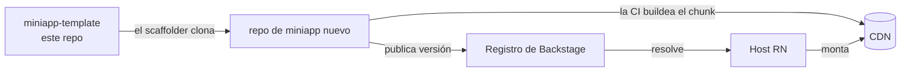

# miniapp-template

> **Plantilla GitHub** para crear una nueva **miniapp** — un **remote federado de Re.Pack** que el host de React Native consume bajo demanda. El scaffolder de [Backstage](https://github.com/DentVega/backstage-web) genera un repo nuevo desde esta plantilla; la CI de la miniapp buildea el chunk federado y lo publica al registro.

**🌐 English:** [README.md](./README.md) · **Demo de la plataforma:** [backstage-web-blond.vercel.app](https://backstage-web-blond.vercel.app)

---

## Dónde encaja



Cada miniapp es **su propio repo** (CI propia, cadencia propia). Esta plantilla es el punto de partida: expone `./Entry` para que el host la monte vía Module Federation.

## Qué contiene

```
manifest.json           Manifest (id, version, entry, deps compartidas, capabilities)
rspack.config.mjs       Config Re.Pack / Module Federation (expone ./Entry)
src/Entry.tsx           Entry de federación — recibe capabilities acotadas, protege el acceso
src/Screen.tsx          La UI de la feature de la miniapp
scripts/                Helpers de build + publish
.github/workflows/      CI: buildea el chunk federado, publica a Backstage
```

## Crear una miniapp desde ella

Usa el flujo **"Create miniapp" de Backstage** (recomendado — además la registra en el catálogo), o **Use this template** en GitHub. Los placeholders como `__MINIAPP_ID__` se rellenan por miniapp.

## Desarrollo

```bash
pnpm install
pnpm start        # dev server del remote en :9000
```

- Edita `src/Screen.tsx` (tu feature) y `src/Entry.tsx` (capability requerida).
- Mantén `manifest.json` en sync (id, version, deps compartidas, capabilities).
- El dev server sirve el chunk en `http://localhost:9000/<id>.container.js.bundle`; el pipeline de CI lo buildea y publica la URL a Backstage para que el host la resuelva.

## Contrato y seguridad

`Entry` recibe `MiniappEntryProps` de `@org/miniapp-contract`: **capabilities acotadas, nunca credenciales crudas**. Si falta el permiso requerido → pantalla de "acceso no autorizado".

## Requisitos

Node 20+, pnpm o npm. Acceso a **GitHub Packages** para `@org/miniapp-contract` y `@org/ui-kit` (`.npmrc` usa `${GITHUB_TOKEN}` con `read:packages` — nunca un token hardcodeado).

## Repos relacionados

| Repo | Rol |
|---|---|
| [backstage-web](https://github.com/DentVega/backstage-web) | Plano de control web que scaffoldea + distribuye miniapps *(demo en vivo)* |
| [backstagereactnative](https://github.com/DentVega/backstagereactnative) | Host React Native + Re.Pack que monta miniapps |
| [miniapp-account-dashboard](https://github.com/DentVega/miniapp-account-dashboard) | Una miniapp real construida con este patrón |

---

<sub>Parte de un demo/portfolio que muestra micro-frontends con Module Federation para React Native.</sub>
