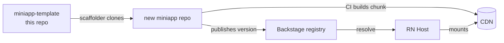

# miniapp-template

> **GitHub template** for creating a new **miniapp** — a **Re.Pack federated remote** consumed on demand by the React Native host. The [Backstage](https://github.com/DentVega/backstage-web) scaffolder generates a fresh repo from this template; the miniapp's CI builds the federated chunk and publishes it to the registry.

**🌐 Español:** [README.es.md](./README.es.md) · **Platform demo:** [backstage-web-blond.vercel.app](https://backstage-web-blond.vercel.app)

---

## Where it fits



Each miniapp is **its own repo** (own CI, own release cadence). This template is the starting point: it exposes `./Entry` so the host can mount it via Module Federation.

## What's inside

```
manifest.json           Manifest (id, version, entry, shared deps, capabilities)
rspack.config.mjs       Re.Pack / Module Federation config (exposes ./Entry)
src/Entry.tsx           Federation entry — receives scoped capabilities, guards access
src/Screen.tsx          The miniapp feature UI
scripts/                Build + publish helpers
.github/workflows/      CI: build the federated chunk, publish to Backstage
```

## Create a miniapp from it

Use the **Backstage "Create miniapp"** flow (recommended — it also registers the miniapp in the catalog), or **Use this template** on GitHub. Placeholders like `__MINIAPP_ID__` are filled in per miniapp.

## Develop

```bash
pnpm install
pnpm start        # remote dev server on :9000
```

- Edit `src/Screen.tsx` (your feature) and `src/Entry.tsx` (required capability).
- Keep `manifest.json` in sync (id, version, shared deps, capabilities).
- The dev server serves the chunk at `http://localhost:9000/<id>.container.js.bundle`; the CI pipeline builds it and publishes the URL to Backstage so the host can resolve it.

## Contract & security

`Entry` receives `MiniappEntryProps` from `@org/miniapp-contract`: **scoped capabilities, never raw credentials**. If the required permission is missing → an "unauthorized access" screen.

## Requirements

Node 20+, pnpm or npm. Access to **GitHub Packages** for `@org/miniapp-contract` and `@org/ui-kit` (`.npmrc` uses `${GITHUB_TOKEN}` with `read:packages` — never a hardcoded token).

## Related repos

| Repo | Role |
|---|---|
| [backstage-web](https://github.com/DentVega/backstage-web) | Web control plane that scaffolds + distributes miniapps *(live demo)* |
| [backstagereactnative](https://github.com/DentVega/backstagereactnative) | React Native + Re.Pack host that mounts miniapps |
| [miniapp-account-dashboard](https://github.com/DentVega/miniapp-account-dashboard) | A real miniapp built on this pattern |

---

<sub>Part of a portfolio/demo showcasing Module Federation micro-frontends for React Native.</sub>
